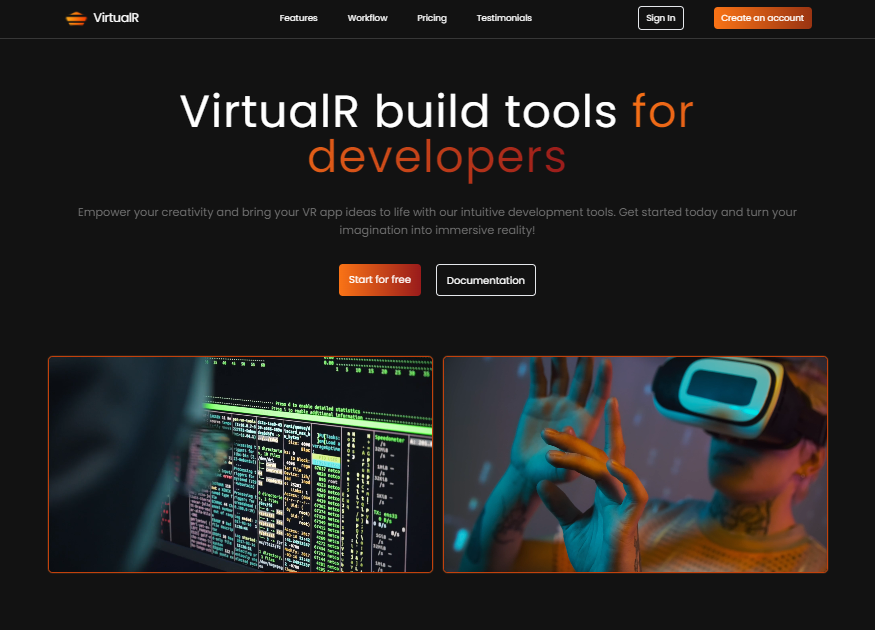

# Fully Responsive Landing Page: React + Tailwind CSS

This is the fully responsive landing page: React + Tailwind CSS from the [YouTube: Build and Deploy Fully Responsive Landing Page: React + Tailwind CSS](https://www.youtube.com/watch?v=EwzWg-Joxq0&t=121s) by [Kushal Dongre](https://github.com/kushald/virtualr). 



## Usage

This project uses JSON-Server for a mock backend.

### Install Dependencies

```bash
npm install lucide-react
```


### Run JSON Server

The server will run on http://localhost:8000

```bash
npm run server
```

### Run Vite Frontend

React will run on http://localhost:5173

```bash
npm run dev
```

### Build for Production

```bash
npm run build
```

### Preview Production Build

```bash
npm run preview
```
